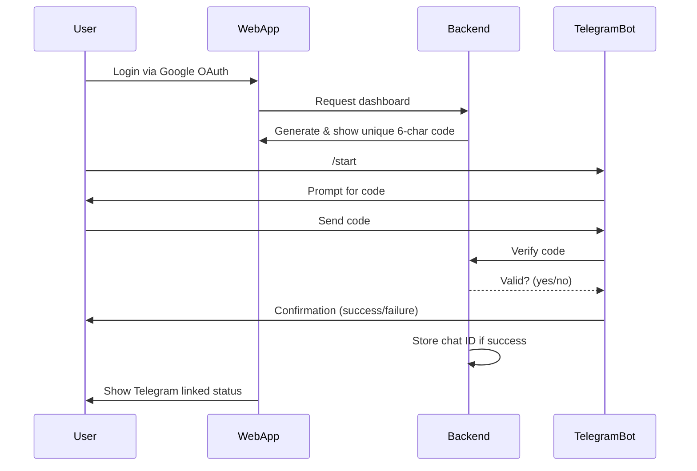

# Telegram Integration Flow

```mermaid
sequenceDiagram
    participant User
    participant WebApp
    participant Backend
    participant TelegramBot

    User->>WebApp: Login via Google OAuth
    WebApp->>Backend: Request dashboard
    Backend->>WebApp: Generate & show unique 6-char code
    User->>TelegramBot: /start
    TelegramBot->>User: Prompt for code
    User->>TelegramBot: Send code
    TelegramBot->>Backend: Verify code
    Backend-->>TelegramBot: Valid? (yes/no)
    TelegramBot->>User: Confirmation (success/failure)
    Backend->>Backend: Store chat ID if success
    WebApp->>User: Show Telegram linked status
```