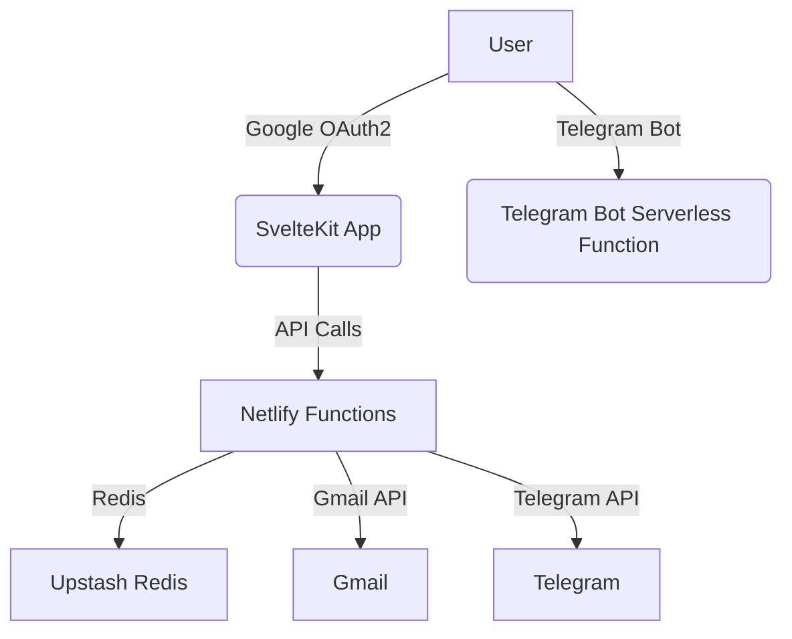

# Architecture

Slot-Alert is a SvelteKit app deployed on Netlify, using serverless functions and Upstash Redis for storage. It integrates with Gmail and Telegram APIs.

- **Frontend:** SvelteKit
- **Backend:** Netlify Functions (Node.js)
- **Storage:** Upstash Redis
- **Integrations:** Gmail API, Telegram Bot API
