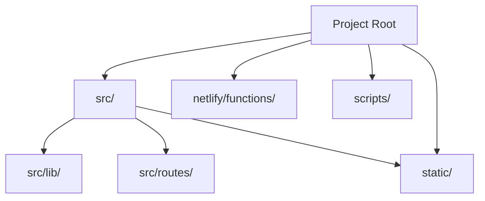

# Development Guide

## Local Setup
1. Clone the repo and run `npm install`.
2. Copy `.env.example` to `.env` and fill in credentials.
3. Run `npm run dev` to start the app.

## Folder Structure

## Contributing
- See [CONTRIBUTING.md](../CONTRIBUTING.md)
